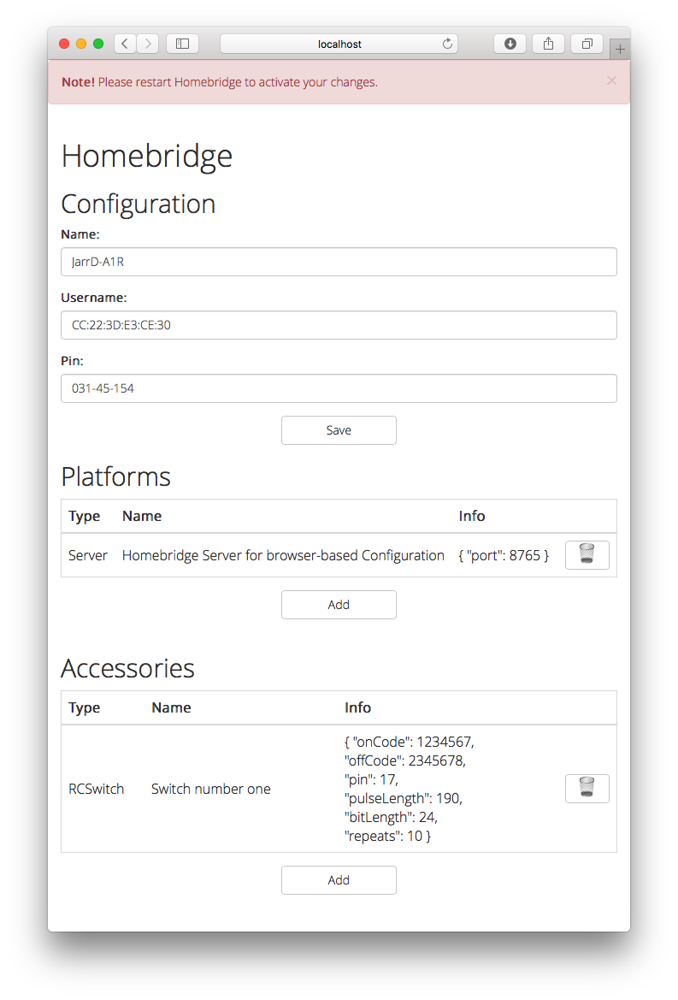

# Homebridge Server - a plugin to configure your homebridge-devices via your Browser

The purpose of this plugin is to change your homebridge configuration via the webbrowser.
Therefore the JSON-things will be handled by the plugin and you - as a user - can easily add your devices to the bridge.



## What will you do with this plugin?

1. Change the broadcasted name of your Homebridge
2. Change the MAC-address used to identify your Homebridge
3. Change the PIN to verify your Homebridge
4. Add or Remove platforms
5. Add or Remove accessories
6. Change the names of your services

## How to setup?

### The Consumer-Way

#### Install

```Bash
[sudo] npm install homebridge-server@latest -g
```

Add the following platform to your Homebridge `config.json`:
```JSON
{
	"platform": "Server",
	"port": 8765,
	"name": "Homebridge Server"
}
```

#### Usage

Depending on your configuration you need to adapt the call!
The basic structure is:

```Bash
homebridge -D -U <HOMEBRIDGE_CONFIG_FOLDER>
```

so using the above example:

```Bash
homebridge -D -U ~/.homebridge
```

After this command, you should be able to access the server on your local machine under `http://localhost:8765`.

### The Developer-Way

#### Install

Clone this repository (to e.g.: `~/Developer/homebridge-server`)

```Bash
git clone https://github.com/gismo141/homebridge-server ~/Developer/homebridge-server
```

Add the following platform to your Homebridge `config.json`:
```JSON
{
	"platform": "Server",
	"port": 8765,
	"name": "Homebridge Server for browser-based Configuration"
}
```

#### Usage

Depending on your configuration you need to adapt the call!
The basic structure is:

```Bash
homebridge -D -U <HOMEBRIDGE_CONFIG_FOLDER> -P <LOCATION_OF_CLONED_SERVER>
```

so using the above example:

```Bash
homebridge -D -U ~/.homebridge -P ~/Developer/homebridge-server
```

After this command, you should be able to access the server on your local machine under `http://localhost:8765`.

## How could you contribute?

1. [Fork this project][fork] to your account.
2. [Create a new branch][branch] for the improvements, you intend to make.
3. **Make the changements in your fork.**
4. [Send a pull-request][pr] from your fork’s branch to my `master` branch.
 
You can always use the web-interface to make the changes you want. It helps you automizing the workflow from above.

[fork]: http://help.github.com/forking/
[branch]: https://help.github.com/articles/creating-and-deleting-branches-within-your-repository
[pr]: http://help.github.com/pull-requests/
